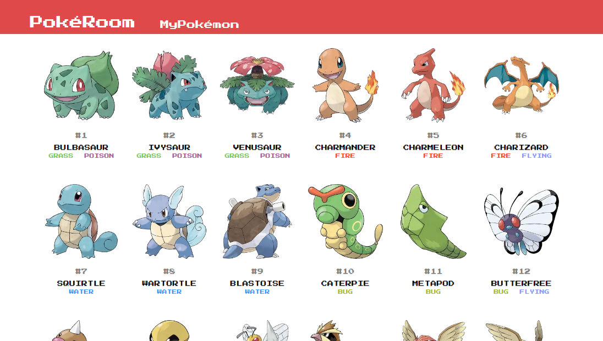

# Poke Room

## Table of contents

- [About](#about)
- [Features](#features)
- [Live Demo](#live-demo)
- [Built with](#built-with)
- [Getting started](#getting-started)
  - [Installation instructions](#installation-instructions)
- [Author](#author)
- [Show your support](#show-your-support)

---

## About

Fan made pokemon catcher app using poke graph API. User can find many pokemon from generation 1 to generation 8. Catch `em all.



## Features

The features of this project are, user can:

1. Display Pokemon.
2. Display Pokemon description and status.
3. Catch & name your Pokemon.
4. Release caught Pokemon.

## Live Demo

This project is hosted on netlify.

[Live demo link](https://poke-room.netlify.app//)

## Built With
 
<div> 
   <a href="https://www.w3.org/html/" target="_blank" rel="noreferrer"> 
     
  </a>
   <a href="https://www.w3schools.com/css/" target="_blank" rel="noreferrer"> 
     
  </a> 
  <a href="https://developer.mozilla.org/en-US/docs/Web/JavaScript" target="_blank" rel="noreferrer"> 
     
  </a>
  <a href="https://nextjs.org/" target="_blank" rel="noreferrer"> 
     
  </a>
  <a href="https://sass-lang.com/" target="_blank" rel="noreferrer"> 
     
  </a>
</div>


## Getting Started

### Installation instructions

Follow along the steps below to get a copy at your local machine.

- Navigate to the directory where you want this project to clone and then clone it

  ```
  git clone git@github.com:lutfianwr/poke-catcher.git
  
  ```
- Navigate to the `poke-catcher` directory

  ```
  cd poke-catcher
  ```

- Install the npm package with `npm install`
- Start the server with `npm run dev`
- The site should automatically open in your browser at http://localhost:3000/ if it didn't then open your browser with that link.
